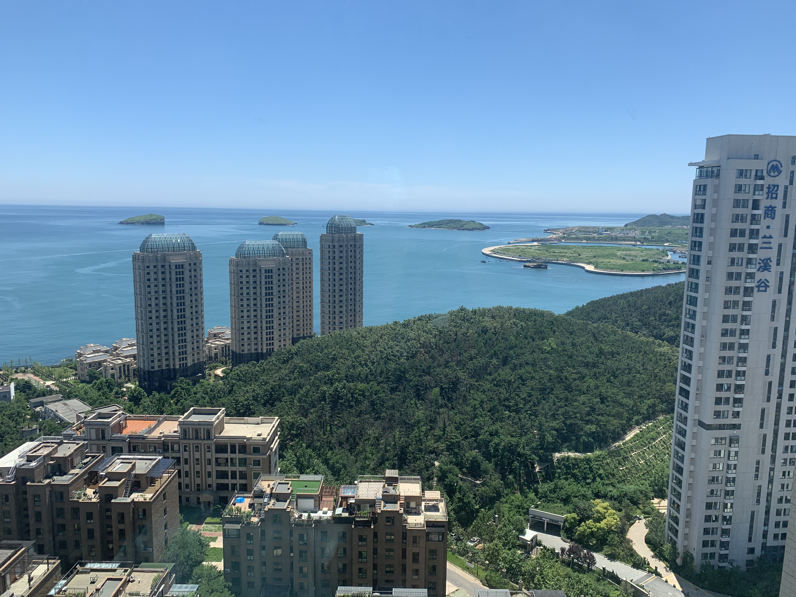
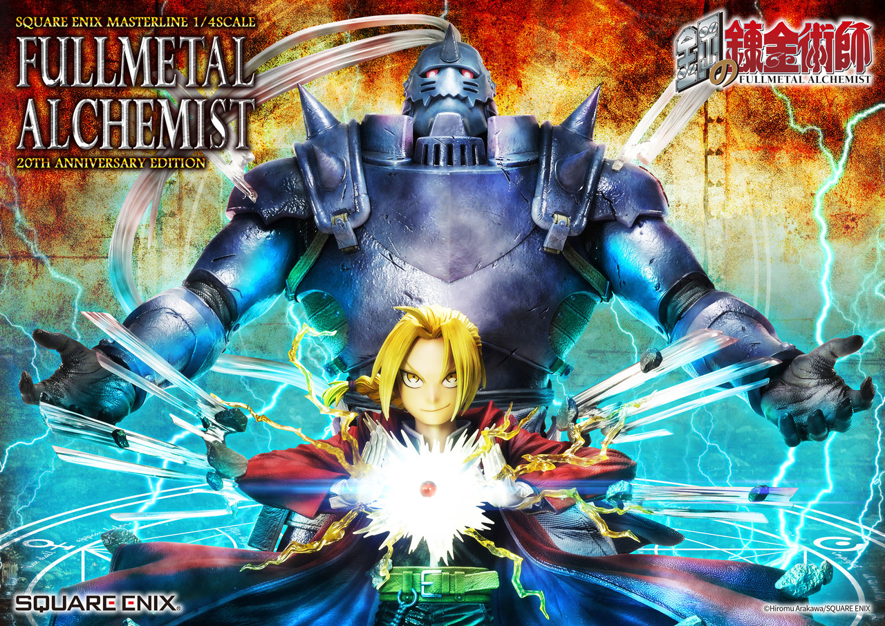
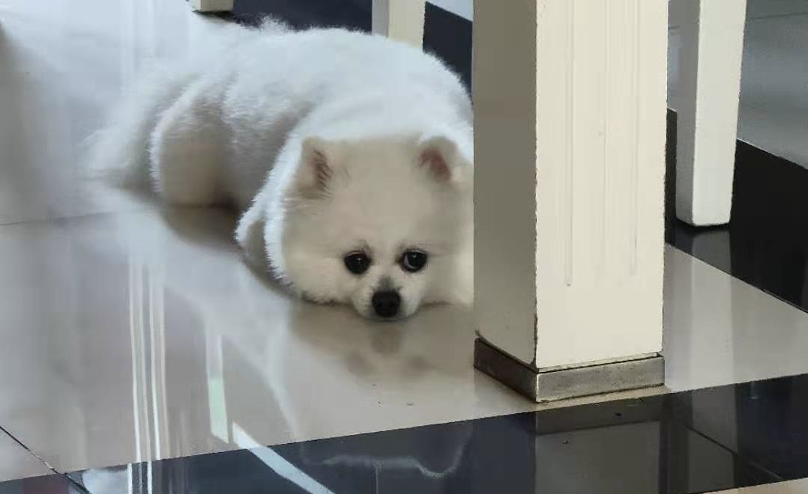

This is a website for Homework 4 of p8105, created by Mengxiao Luan.

Welcome to Mengxiao's website!

 Shot by me in [Bunga Mekar](https://ms.wikipedia.org/wiki/Bunga_Mekar).

## My Hometown

I come from a coastal city in the Northeast part of China, which sits in the wide embrace of the Huanghai and Bohai sea.

This image shows the scenery looking down from the window of my home:

## Recent Graduate

I am a current graduate student at Columbia University, before which I have just graduated this summer from Tsinghua University, China.

Here's a photo of me and my roommates in bachelor's gown!

## A Huge Anime Fan

I enjoy watching animes in my spare time, and among all those I have watched so far, this is my favorite: 
[Fullmetal Alchemist](https://en.wikipedia.org/wiki/Fullmetal_Alchemist).

 image from [SQUARE ENIX STORE](https://na.store.square-enix-games.com/square-enix-masterline-fullmetal-alchemist-20th-anniversary-edition-1_4-scale-).

## A Future Dog Owner

I've always been dreaming of keeping a dog, and I guess I'll realize that in less than 5 years, hopefully.

Check this out! A cute dog of my friend's. Her name is Duoduo and she likes to bark at me everytime she sees me.

## Learn More...

Here's [my resume](resume.html), from which you can learn more about me!

This is a [link](http://github.com/ml5018/) to my github home page.

And this is a [dashboard](dashboard.html) I created using R.